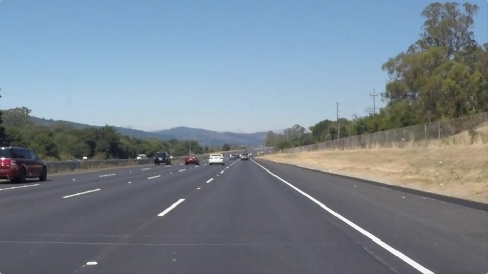
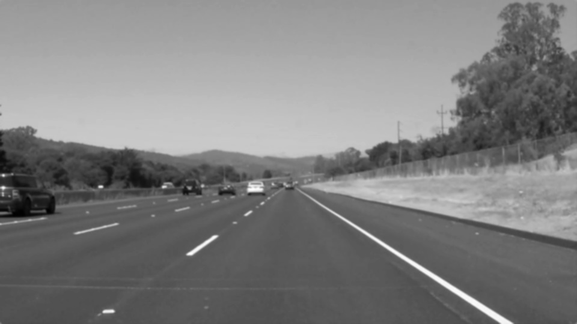
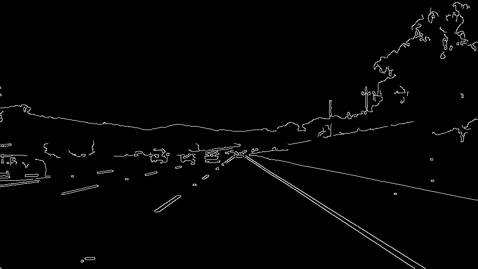
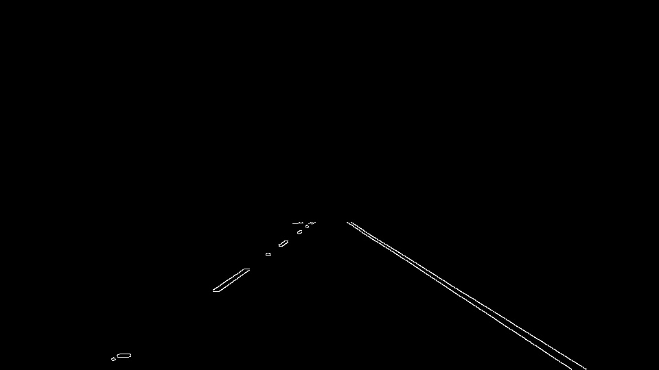
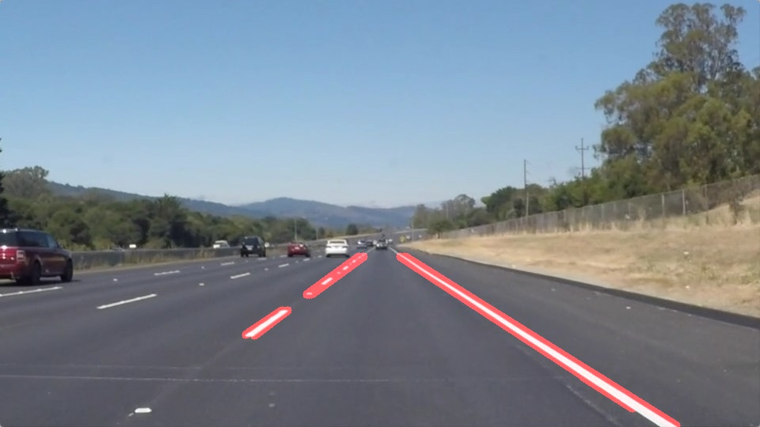
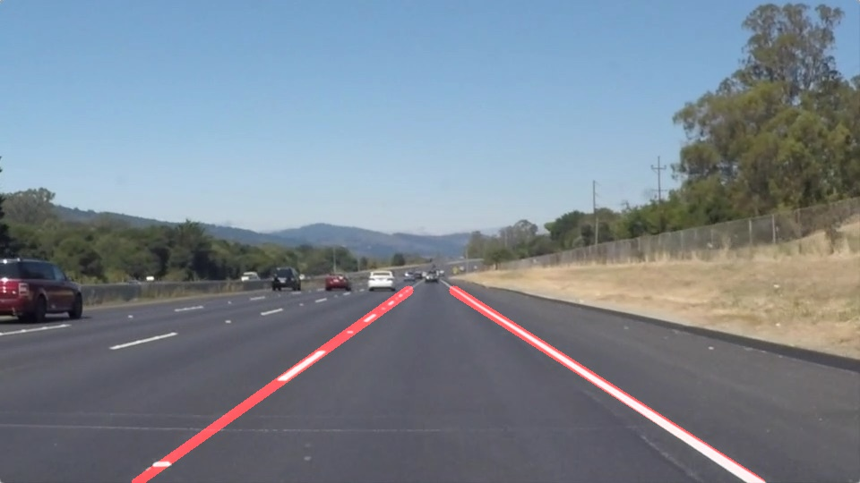
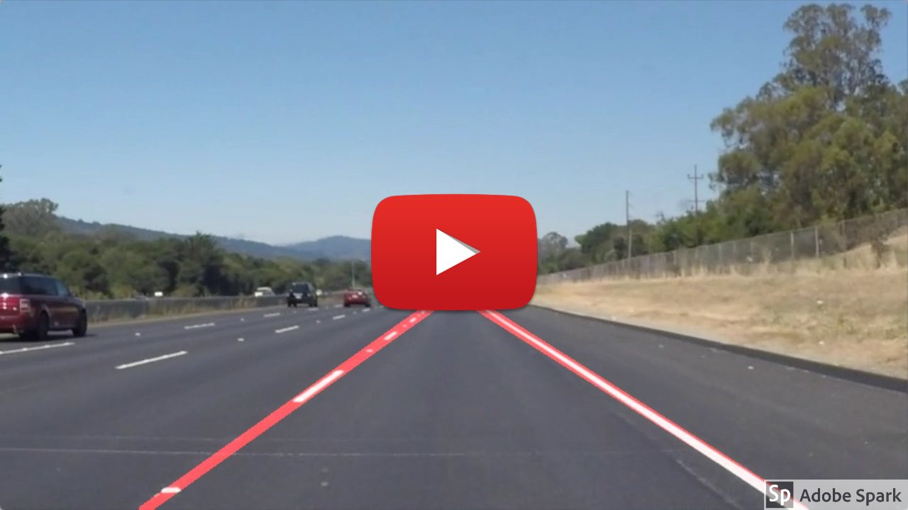

# **Finding Lane Lines on the Road** 

## Writeup

---

**Finding Lane Lines on the Road**

The goals / steps of this project are the following:
* Make a pipeline that finds lane lines on the road
* Reflect on your work in a written report

## Reflection

###  Pipeline description

Pipeline to find lane lines on the road consisits of the following steps:

#### 1. Convert input image to grayscale and then apply gaussian smoothing to it.
#### 2. Apply canny edge detection to find out edges.
#### 3. Apply trapezium shaped mask to detected edges.
#### 4. Detect lines in masked edges using probabilistic hough transform
#### 5. Extrapolate and merge multiple detected lines in order to draw a single line on the left and right lanes
 * To achieve this last step, I made few changes to draw_lines() 
  1. Filtered out lines for left lane and right lane by using the observation that in images captured by top mounted camera, left lane makes an angle between 20° to 70° with the horizontal and similarly right lane makes an angle between 110° to 160° with the horizontal.
  2. Fit linear regression model in left and right lines. For data points, we just get start and end point coordiantes from cv2.HoughLinesP(). In order to fit linear regression model better, augment data points by repeating each datapoint proportionally to the length of its line segment.
  3. Find out coordinates of final detected left lane and right by using their corresponding linear model.

Input Image             |  Smoothened Grayscale Image
:-------------------------:|:-------------------------:
 |  

Detected Edges             |  Masked Edges
:-------------------------:|:-------------------------:
 |  

Detected Lines             |  Final Extrapolated Lines
:-------------------------:|:-------------------------:
 |  

### Potential shortcomings with current pipeline

 1. It would not be able to detect lane lines in different light conditions eg. in dark.
 2. It would not be able to properly identify curved lane lines.
 3. Change in camera's resolution or mounting angle can be fatal for current pipeline.

###  Possible improvements

 1. Detection of curved lane lines.
 2. Detection of lane lines in different light and weather condtion
 3. Try to make pipeline independent of camera's mounting position
